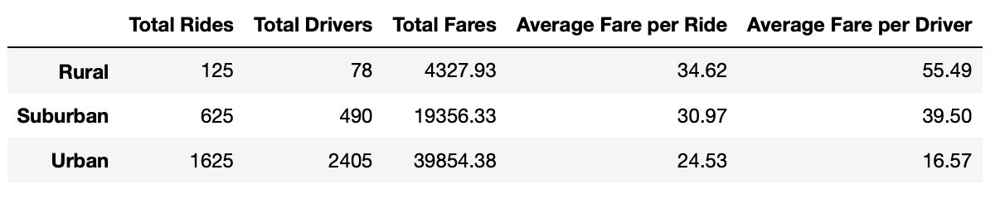

# Ride_Sharing_Challenge

## Overview

### Background

This ride sharing dataset includes driver, fare, city information for each ride logged as well as city type (urban, suburban, rural).

### Purpose

This analysis computes ride statistics by city type in order to discern differences between each city type and ride sharing behaviours. 

## Results

### Summary Statistics
  
  * Ride, driver, and fare volume increased with city size but average fare per ride and per driver decreased

### Fare Differences

  * Total fares collected increased with city size. with urban cities accounting for the greatest proportion of fare revenue by a significant marging
  

## Summary

### Recommendations

  * The dataset did not include information related to ride length, which may account for the differences between city type
    * Collecting this information may improve decision making 
  * A short ride premium or base price could be applied to equalize driver earnings
  * Since urban locations account for the bulk of fares and drivers, an increased focus on urban passengers may be justified

